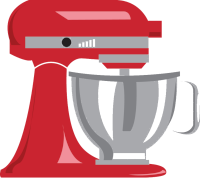

<h1 align="center">
  MixerAPI
</h1>
<p align="center">
  <a href="http://mixerapi.com/">
    
  </a>
</p>
<h3 align="center">
  Streamline development of API-first applications in CakePHP
</h3>
<p align="center">
    <a href="LICENSE.txt" target="_blank">
        
    </a>
    <a href="https://travis-ci.org/mixerapi/mixerapi" target="_blank">
        
    </a>
    <a href="https://coveralls.io/github/mixerapi/mixerapi?branch=master" target="_blank">
        
    </a>
    <a href="https://packagist.org/packages/mixerapi/mixerapi" target="_blank">
        
    </a>
    <a href="https://book.cakephp.org/4/en/index.html">
        = 4" src="https://img.shields.io/badge/cakephp-%3E%3D%204.0-red?logo=cakephp">
    </a>
    <a href="https://php.net/" target="_blank">
        = 7.2" src="https://img.shields.io/badge/php-%3E%3D%207.2-8892BF.svg?logo=php">
    </a>
</p>

*Note: This is an alpha stage plugin*

MixerAPI is a plugin of plugins, that is to say, it combines many CakePHP libraries into a coherent package to 
streamline API development for CakePHP applications. It eases following a [REST](https://restfulapi.net) 
architecture style and [HATEOS](https://restfulapi.net/hateoas/). In other words, it makes developing APIs a piece 
of cake.

[Demo Application](#) | [Demo Source Code](#)

## Installation 

```bash
composer require mixerapi/mixerapi
```

## Setup

To load all MixerApi plugins run `bin/cake plugin load MixerApi`. Alternatively, you can modify your Applications 
bootstrap method yourself:

```php
# src/Application.php
public function bootstrap(): void
{
    // other logic...
    $this->addPlugin('MixerApi');
}
```

You can also load plugins individually. For instance, if your project only requires HalView and SwaggerBake your 
`Application->bootstrap()` would resemble this:

```php
# src/Application.php
public function bootstrap(): void
{
    // other logic...
    $this->addPlugin('MixerApi/HalView');
    $this->addPlugin('SwaggerBake');
}
```

If you don't need the entire suite of plugins simply `composer require` on an as-needed basis. It's up to you!

## Plugins

MixerAPI automatically installs the following plugins for your RESTful API project:

### [MixerApi/Bake](https://github.com/mixerapi/bake)
[![MixerApi](https://img.shields.io/badge/mixerapi-plugin-blue?logo=data:image/png;base64,iVBORw0KGgoAAAANSUhEUgAAABAAAAAOCAYAAAAmL5yKAAAFyHpUWHRSYXcgcHJvZmlsZSB0eXBlIGV4aWYAAHjarVdpsjMnDPzPKXIEkBDLcVircoMcP81qe977tlQ89sCwiFa3EGPV/vm7q7/wIR20suKDi85pfGy0kRIqQa9PnHej7bzvB30qH+1Kt91BaGKUvB592uMT2uU14axh8me7CruHwjZkruH54bHyqNd3kGin1W7sNhQ3IheDf4eat6GyB04o+2cvrFWMZ/XR4MFSFSzERI0Na9yJNwJev4RfmHfCOMMWdWJWKIQPEhDy4d5lVr8T9EHyqakn+4f7J/mU9gh+cOmOau77DiOPdr7r0/vCfBHRZ0eLx9RXknuvofe2vEvWgVG3I2qSbY4ZDMygnOc0h8vjJ6j7eUVcQSddIHnVRWdcxURDUKUrY001yXTTZllMAURLjTxKokI82wJ7ilR46YTLdPIcuUJB4kJNMaOZLhYz141zvWICVq4GQ8nAmMGUH17qZ51/cqney6DIDDLb4gq4aMQ1YAzlxh2jIIjpWzeZBJ9ry6/fAguhCgVl0hzgYNJ5mchiXrHFU2fGOEG5tpBRvm4DoAhrC8AYhgLaGRbjjPZE3hjwGCBQAnJiSxkKGBGqAEmW2ZHyFGisjTnezLEk5Gg0IzdBCGHHHtpEThDLWkH8eBsQQ0lYrIg48RKUREmOnXXinPNuJLnk2Vsv3nnvg48+BQ42SHDBhxBiSJEiIwdKdNHHEGNMiVTCQgm2EsYntGTKnG2W7LLPIcecCsKn2CLFFV9CiSVVqlyRJqqrvoYaa2pGNWSKZps013wLLbbUEWudu+3SXfc99NjTVW2r+uX6A9XMVo2mUmOcv6qhVXl/TJiRTmRoBsXIGijuhwIIaBqa6WCspaHc0ExHZDMWAkgZ2qhqhmKQ0DZD0s3V7qXcb+mmJPyWbvQr5dSQ7v9QTkG6r7p9o1od51yZiq1dODjVjN2H/haSooARXUJChXLJsBAMzUdwbgVfbJ4+KzjL4u6CorOmT6meDUSzEs0gdZqBN0hgw6Y0ZMAYg8wFtH4vkSG1abnOOT4mXxvGz1UjZy3LvDlzoe/sm7KshUBITDartao91suGrndpPS+3MFOA5dRdqHuN2ObU8TaSgm+uHD5O6YFu+eNN92XThAxvXV8dCTaue+o7f3+jNGYaswFndxrIVCoFOnXKS7ZquXN4KoDDYo5OHQdP1SG65XjV3S4XM7YIN10OqToux5jjCgjQyGn1pmCX29i6NxwupWpX7KEOwbgYsNhqP/KrZbNldr5FItTVx8C+zJF1iwFjD/V0bPjlVcJGa33h6VZ3cPTkw9QdEQDXDjgOvxJBXbTVvwUl8vBSO9ZwwZywxXHNTRb6nLEXBZypHTR0Ytti4xaPd681J3ZOxz0xm/+KLbn6EWJIMGMnqMG0O2tipeUM3vG+RIBb7HQqkKM8WVTaS32tjsHLUk2+lLjnIn/QsWfTaaqnaY6aiELbnfl6kU4yiPWiNfJAy9XTQalG1IR0AvXEV8sLS4uMbVjjJtYiiVC7RFA+prmpFE/Yer77de/Q1w7m42M4lZTP4FL37rfh5o4u8pEpd0i9fLGLhIyToJVNvi09jPejb4G+46wXJz9w3rj3JauFEKh62pkxGRBrvxL7Lj/pLf/NhOpkU835ZBKHTIKT77BxBpA5I+l01XKjTT0HNSk7fp2vvFIr3pAh15odkVuz7G0Qxvll595SOOxDfnBKbp0kcfxr2/k2jhdIWdkmleZx7H9kIIVpfOb7ZyI4EsttOU4BYXoh5HkcbYhpQRS8pPvnkdLqqtWCPYqTeT4URAsCzp1Uu6jl9pW/B7wbbPEcfOYtS6mdjVJ/4w/xtY5Bu3NmQiDeOHA3KEPLy79qm8LfwQ3OIPRYdg/OlVLbK3cZ6j9K4MWuI1uKBgiNP+2vBPJNuk/vkicbD5/n/FHhP56Qdwm/PMXrsaa6GksJ1Z1AER4vB8e1UC5FHe9K+M+u/gUl5tY9Xma1NwAAAYRpQ0NQSUNDIHByb2ZpbGUAACiRfZE9SMNAHMVfU6VFKoIWEXEIWJ0siIo4ahWKUCHUCq06mFz6BU0akhQXR8G14ODHYtXBxVlXB1dBEPwAcXJ0UnSREv+XFFrEenDcj3f3HnfvAKFWYprVMQ5oum0m4zExnVkVA68IQkAv+jEsM8uYk6QE2o6ve/j4ehflWe3P/Tm61azFAJ9IPMsM0ybeIJ7etA3O+8RhVpBV4nPiMZMuSPzIdcXjN855lwWeGTZTyXniMLGYb2GlhVnB1IiniCOqplO+kPZY5bzFWStVWOOe/IWhrL6yzHWaQ4hjEUuQIEJBBUWUYCNKq06KhSTtx9r4B12/RC6FXEUwciygDA2y6wf/g9/dWrnJCS8pFAM6XxznYwQI7AL1quN8HztO/QTwPwNXetNfrgEzn6RXm1rkCOjZBi6um5qyB1zuAANPhmzKruSnKeRywPsZfVMG6LsFuta83hr7OH0AUtRV4gY4OARG85S93ubdwdbe/j3T6O8HPmBykhIwfzgAAAAGYktHRAD/AP8A/6C9p5MAAAAJcEhZcwAACxMAAAsTAQCanBgAAAAHdElNRQfkCAISFzd55Cb5AAAChElEQVQoz3WST0hUURTGv/vufTPvzdjYPGcMG8ks/0zaGKM5C4eJgsxatAgiSAcqWtQmiIJAF7rKFrYqChpy0UpDamO5iQwJgjRTiBwTSw3/oOWoTTbP9+a926L5o0Xf6vAdvh/n3HsIALwtq75NTPM6AAiyBGIRsVmEA4a20ctU7Yp/cnRmS+/lweAJ++p6n5AyBLsNrkMhCFYrSMrjANY+jSMxMTkMw4wEJkcjaQD7ufLDYycCtKpyIBWZnZvGPxIJSGlRDY9+fgAgCxCN5MiGwBBraAAIAThPTo19xN4y7weA66YoBjIQzkdOPbtYvZnLXKIUBeftno67TWB0OwzzlwfIxfP+IdPlJAsXwhkAp0L534Ol18S7w8drzLnFF+Dc+q22qud9ZcU9Sqle3/V0R/xIMAwAxvJy15uy0kVKaY5hGEttrS1RlgYYC0s+wrkTAOyKoiuKMijLcqzv9MlmRXEeiMVWfAX7K8PuZLJfkqRVm83W/rDzkV/IjCKykuyq3LRarbDZbFNtrS0RtztfAgCHwwFFUWYkSfKoqrqiaVptBmAkNirStRSd+GqaJgDsTlmlFosl3V7Tdd1x/lzTFwDIAChjoUw9u+BVVbWXc57X/fiJX9M0iGLmuBYJIcMAQCl1UwAY9NbWGIZ+VUi9qSBZd2p1gRtL8XijLMtuQkiFLMtgjEUBaITg1tH6Y3aAiAwAksRsBM/+iTNY5yruuBOIN18Lz8/PdxcWFoJSCgAJznmk8eyZaGqaGTbg9Retm8blXPInLZUUw15QgLV8903vwOu+sVAQHLiUCiSqOnuGttzBqz2+aVkQioTsSfxXzJUHui3nu2WXJ7Sv8/44APwG3yPg36V3p7wAAAAASUVORK5CYII=)](https://github.com/mixerapi/bake)

A custom bake template focused on creating RESTful CakePHP controllers in seconds.

```bash
# bake all your controllers
bin/cake bake controller all --theme MixerApi/Bake
```

Read the full documentation [here](https://github.com/mixerapi/bake).

### [MixerApi/Rest](https://github.com/mixerapi/rest)
[![MixerApi](https://img.shields.io/badge/mixerapi-plugin-blue?logo=data:image/png;base64,iVBORw0KGgoAAAANSUhEUgAAABAAAAAOCAYAAAAmL5yKAAAFyHpUWHRSYXcgcHJvZmlsZSB0eXBlIGV4aWYAAHjarVdpsjMnDPzPKXIEkBDLcVircoMcP81qe977tlQ89sCwiFa3EGPV/vm7q7/wIR20suKDi85pfGy0kRIqQa9PnHej7bzvB30qH+1Kt91BaGKUvB592uMT2uU14axh8me7CruHwjZkruH54bHyqNd3kGin1W7sNhQ3IheDf4eat6GyB04o+2cvrFWMZ/XR4MFSFSzERI0Na9yJNwJev4RfmHfCOMMWdWJWKIQPEhDy4d5lVr8T9EHyqakn+4f7J/mU9gh+cOmOau77DiOPdr7r0/vCfBHRZ0eLx9RXknuvofe2vEvWgVG3I2qSbY4ZDMygnOc0h8vjJ6j7eUVcQSddIHnVRWdcxURDUKUrY001yXTTZllMAURLjTxKokI82wJ7ilR46YTLdPIcuUJB4kJNMaOZLhYz141zvWICVq4GQ8nAmMGUH17qZ51/cqney6DIDDLb4gq4aMQ1YAzlxh2jIIjpWzeZBJ9ry6/fAguhCgVl0hzgYNJ5mchiXrHFU2fGOEG5tpBRvm4DoAhrC8AYhgLaGRbjjPZE3hjwGCBQAnJiSxkKGBGqAEmW2ZHyFGisjTnezLEk5Gg0IzdBCGHHHtpEThDLWkH8eBsQQ0lYrIg48RKUREmOnXXinPNuJLnk2Vsv3nnvg48+BQ42SHDBhxBiSJEiIwdKdNHHEGNMiVTCQgm2EsYntGTKnG2W7LLPIcecCsKn2CLFFV9CiSVVqlyRJqqrvoYaa2pGNWSKZps013wLLbbUEWudu+3SXfc99NjTVW2r+uX6A9XMVo2mUmOcv6qhVXl/TJiRTmRoBsXIGijuhwIIaBqa6WCspaHc0ExHZDMWAkgZ2qhqhmKQ0DZD0s3V7qXcb+mmJPyWbvQr5dSQ7v9QTkG6r7p9o1od51yZiq1dODjVjN2H/haSooARXUJChXLJsBAMzUdwbgVfbJ4+KzjL4u6CorOmT6meDUSzEs0gdZqBN0hgw6Y0ZMAYg8wFtH4vkSG1abnOOT4mXxvGz1UjZy3LvDlzoe/sm7KshUBITDartao91suGrndpPS+3MFOA5dRdqHuN2ObU8TaSgm+uHD5O6YFu+eNN92XThAxvXV8dCTaue+o7f3+jNGYaswFndxrIVCoFOnXKS7ZquXN4KoDDYo5OHQdP1SG65XjV3S4XM7YIN10OqToux5jjCgjQyGn1pmCX29i6NxwupWpX7KEOwbgYsNhqP/KrZbNldr5FItTVx8C+zJF1iwFjD/V0bPjlVcJGa33h6VZ3cPTkw9QdEQDXDjgOvxJBXbTVvwUl8vBSO9ZwwZywxXHNTRb6nLEXBZypHTR0Ytti4xaPd681J3ZOxz0xm/+KLbn6EWJIMGMnqMG0O2tipeUM3vG+RIBb7HQqkKM8WVTaS32tjsHLUk2+lLjnIn/QsWfTaaqnaY6aiELbnfl6kU4yiPWiNfJAy9XTQalG1IR0AvXEV8sLS4uMbVjjJtYiiVC7RFA+prmpFE/Yer77de/Q1w7m42M4lZTP4FL37rfh5o4u8pEpd0i9fLGLhIyToJVNvi09jPejb4G+46wXJz9w3rj3JauFEKh62pkxGRBrvxL7Lj/pLf/NhOpkU835ZBKHTIKT77BxBpA5I+l01XKjTT0HNSk7fp2vvFIr3pAh15odkVuz7G0Qxvll595SOOxDfnBKbp0kcfxr2/k2jhdIWdkmleZx7H9kIIVpfOb7ZyI4EsttOU4BYXoh5HkcbYhpQRS8pPvnkdLqqtWCPYqTeT4URAsCzp1Uu6jl9pW/B7wbbPEcfOYtS6mdjVJ/4w/xtY5Bu3NmQiDeOHA3KEPLy79qm8LfwQ3OIPRYdg/OlVLbK3cZ6j9K4MWuI1uKBgiNP+2vBPJNuk/vkicbD5/n/FHhP56Qdwm/PMXrsaa6GksJ1Z1AER4vB8e1UC5FHe9K+M+u/gUl5tY9Xma1NwAAAYRpQ0NQSUNDIHByb2ZpbGUAACiRfZE9SMNAHMVfU6VFKoIWEXEIWJ0siIo4ahWKUCHUCq06mFz6BU0akhQXR8G14ODHYtXBxVlXB1dBEPwAcXJ0UnSREv+XFFrEenDcj3f3HnfvAKFWYprVMQ5oum0m4zExnVkVA68IQkAv+jEsM8uYk6QE2o6ve/j4ehflWe3P/Tm61azFAJ9IPMsM0ybeIJ7etA3O+8RhVpBV4nPiMZMuSPzIdcXjN855lwWeGTZTyXniMLGYb2GlhVnB1IiniCOqplO+kPZY5bzFWStVWOOe/IWhrL6yzHWaQ4hjEUuQIEJBBUWUYCNKq06KhSTtx9r4B12/RC6FXEUwciygDA2y6wf/g9/dWrnJCS8pFAM6XxznYwQI7AL1quN8HztO/QTwPwNXetNfrgEzn6RXm1rkCOjZBi6um5qyB1zuAANPhmzKruSnKeRywPsZfVMG6LsFuta83hr7OH0AUtRV4gY4OARG85S93ubdwdbe/j3T6O8HPmBykhIwfzgAAAAGYktHRAD/AP8A/6C9p5MAAAAJcEhZcwAACxMAAAsTAQCanBgAAAAHdElNRQfkCAISFzd55Cb5AAAChElEQVQoz3WST0hUURTGv/vufTPvzdjYPGcMG8ks/0zaGKM5C4eJgsxatAgiSAcqWtQmiIJAF7rKFrYqChpy0UpDamO5iQwJgjRTiBwTSw3/oOWoTTbP9+a926L5o0Xf6vAdvh/n3HsIALwtq75NTPM6AAiyBGIRsVmEA4a20ctU7Yp/cnRmS+/lweAJ++p6n5AyBLsNrkMhCFYrSMrjANY+jSMxMTkMw4wEJkcjaQD7ufLDYycCtKpyIBWZnZvGPxIJSGlRDY9+fgAgCxCN5MiGwBBraAAIAThPTo19xN4y7weA66YoBjIQzkdOPbtYvZnLXKIUBeftno67TWB0OwzzlwfIxfP+IdPlJAsXwhkAp0L534Ol18S7w8drzLnFF+Dc+q22qud9ZcU9Sqle3/V0R/xIMAwAxvJy15uy0kVKaY5hGEttrS1RlgYYC0s+wrkTAOyKoiuKMijLcqzv9MlmRXEeiMVWfAX7K8PuZLJfkqRVm83W/rDzkV/IjCKykuyq3LRarbDZbFNtrS0RtztfAgCHwwFFUWYkSfKoqrqiaVptBmAkNirStRSd+GqaJgDsTlmlFosl3V7Tdd1x/lzTFwDIAChjoUw9u+BVVbWXc57X/fiJX9M0iGLmuBYJIcMAQCl1UwAY9NbWGIZ+VUi9qSBZd2p1gRtL8XijLMtuQkiFLMtgjEUBaITg1tH6Y3aAiAwAksRsBM/+iTNY5yruuBOIN18Lz8/PdxcWFoJSCgAJznmk8eyZaGqaGTbg9Retm8blXPInLZUUw15QgLV8903vwOu+sVAQHLiUCiSqOnuGttzBqz2+aVkQioTsSfxXzJUHui3nu2WXJ7Sv8/44APwG3yPg36V3p7wAAAAASUVORK5CYII=)](https://github.com/mixerapi/rest)

Gets your API project up and going quickly by creating routes for you. It can either:

- Build your routes.php file from a single command, or
- Automatically expose RESTful CRUD routes with a handy middleware.

```
# src/Application.php
public function middleware(MiddlewareQueue $middlewareQueue): MiddlewareQueue
{
    $middlewareQueue->add(new RoutingMiddleware($this))->add(new AutoRoutingMiddleware());

    return $middlewareQueue;
}
```

Read the full documentation [here](https://github.com/mixerapi/rest).

### [SwaggerBake](https://github.com/cnizzardini/cakephp-swagger-bake)
[![MixerApi](https://img.shields.io/badge/mixerapi-plugin-blue?logo=data:image/png;base64,iVBORw0KGgoAAAANSUhEUgAAABAAAAAOCAYAAAAmL5yKAAAFyHpUWHRSYXcgcHJvZmlsZSB0eXBlIGV4aWYAAHjarVdpsjMnDPzPKXIEkBDLcVircoMcP81qe977tlQ89sCwiFa3EGPV/vm7q7/wIR20suKDi85pfGy0kRIqQa9PnHej7bzvB30qH+1Kt91BaGKUvB592uMT2uU14axh8me7CruHwjZkruH54bHyqNd3kGin1W7sNhQ3IheDf4eat6GyB04o+2cvrFWMZ/XR4MFSFSzERI0Na9yJNwJev4RfmHfCOMMWdWJWKIQPEhDy4d5lVr8T9EHyqakn+4f7J/mU9gh+cOmOau77DiOPdr7r0/vCfBHRZ0eLx9RXknuvofe2vEvWgVG3I2qSbY4ZDMygnOc0h8vjJ6j7eUVcQSddIHnVRWdcxURDUKUrY001yXTTZllMAURLjTxKokI82wJ7ilR46YTLdPIcuUJB4kJNMaOZLhYz141zvWICVq4GQ8nAmMGUH17qZ51/cqney6DIDDLb4gq4aMQ1YAzlxh2jIIjpWzeZBJ9ry6/fAguhCgVl0hzgYNJ5mchiXrHFU2fGOEG5tpBRvm4DoAhrC8AYhgLaGRbjjPZE3hjwGCBQAnJiSxkKGBGqAEmW2ZHyFGisjTnezLEk5Gg0IzdBCGHHHtpEThDLWkH8eBsQQ0lYrIg48RKUREmOnXXinPNuJLnk2Vsv3nnvg48+BQ42SHDBhxBiSJEiIwdKdNHHEGNMiVTCQgm2EsYntGTKnG2W7LLPIcecCsKn2CLFFV9CiSVVqlyRJqqrvoYaa2pGNWSKZps013wLLbbUEWudu+3SXfc99NjTVW2r+uX6A9XMVo2mUmOcv6qhVXl/TJiRTmRoBsXIGijuhwIIaBqa6WCspaHc0ExHZDMWAkgZ2qhqhmKQ0DZD0s3V7qXcb+mmJPyWbvQr5dSQ7v9QTkG6r7p9o1od51yZiq1dODjVjN2H/haSooARXUJChXLJsBAMzUdwbgVfbJ4+KzjL4u6CorOmT6meDUSzEs0gdZqBN0hgw6Y0ZMAYg8wFtH4vkSG1abnOOT4mXxvGz1UjZy3LvDlzoe/sm7KshUBITDartao91suGrndpPS+3MFOA5dRdqHuN2ObU8TaSgm+uHD5O6YFu+eNN92XThAxvXV8dCTaue+o7f3+jNGYaswFndxrIVCoFOnXKS7ZquXN4KoDDYo5OHQdP1SG65XjV3S4XM7YIN10OqToux5jjCgjQyGn1pmCX29i6NxwupWpX7KEOwbgYsNhqP/KrZbNldr5FItTVx8C+zJF1iwFjD/V0bPjlVcJGa33h6VZ3cPTkw9QdEQDXDjgOvxJBXbTVvwUl8vBSO9ZwwZywxXHNTRb6nLEXBZypHTR0Ytti4xaPd681J3ZOxz0xm/+KLbn6EWJIMGMnqMG0O2tipeUM3vG+RIBb7HQqkKM8WVTaS32tjsHLUk2+lLjnIn/QsWfTaaqnaY6aiELbnfl6kU4yiPWiNfJAy9XTQalG1IR0AvXEV8sLS4uMbVjjJtYiiVC7RFA+prmpFE/Yer77de/Q1w7m42M4lZTP4FL37rfh5o4u8pEpd0i9fLGLhIyToJVNvi09jPejb4G+46wXJz9w3rj3JauFEKh62pkxGRBrvxL7Lj/pLf/NhOpkU835ZBKHTIKT77BxBpA5I+l01XKjTT0HNSk7fp2vvFIr3pAh15odkVuz7G0Qxvll595SOOxDfnBKbp0kcfxr2/k2jhdIWdkmleZx7H9kIIVpfOb7ZyI4EsttOU4BYXoh5HkcbYhpQRS8pPvnkdLqqtWCPYqTeT4URAsCzp1Uu6jl9pW/B7wbbPEcfOYtS6mdjVJ/4w/xtY5Bu3NmQiDeOHA3KEPLy79qm8LfwQ3OIPRYdg/OlVLbK3cZ6j9K4MWuI1uKBgiNP+2vBPJNuk/vkicbD5/n/FHhP56Qdwm/PMXrsaa6GksJ1Z1AER4vB8e1UC5FHe9K+M+u/gUl5tY9Xma1NwAAAYRpQ0NQSUNDIHByb2ZpbGUAACiRfZE9SMNAHMVfU6VFKoIWEXEIWJ0siIo4ahWKUCHUCq06mFz6BU0akhQXR8G14ODHYtXBxVlXB1dBEPwAcXJ0UnSREv+XFFrEenDcj3f3HnfvAKFWYprVMQ5oum0m4zExnVkVA68IQkAv+jEsM8uYk6QE2o6ve/j4ehflWe3P/Tm61azFAJ9IPMsM0ybeIJ7etA3O+8RhVpBV4nPiMZMuSPzIdcXjN855lwWeGTZTyXniMLGYb2GlhVnB1IiniCOqplO+kPZY5bzFWStVWOOe/IWhrL6yzHWaQ4hjEUuQIEJBBUWUYCNKq06KhSTtx9r4B12/RC6FXEUwciygDA2y6wf/g9/dWrnJCS8pFAM6XxznYwQI7AL1quN8HztO/QTwPwNXetNfrgEzn6RXm1rkCOjZBi6um5qyB1zuAANPhmzKruSnKeRywPsZfVMG6LsFuta83hr7OH0AUtRV4gY4OARG85S93ubdwdbe/j3T6O8HPmBykhIwfzgAAAAGYktHRAD/AP8A/6C9p5MAAAAJcEhZcwAACxMAAAsTAQCanBgAAAAHdElNRQfkCAISFzd55Cb5AAAChElEQVQoz3WST0hUURTGv/vufTPvzdjYPGcMG8ks/0zaGKM5C4eJgsxatAgiSAcqWtQmiIJAF7rKFrYqChpy0UpDamO5iQwJgjRTiBwTSw3/oOWoTTbP9+a926L5o0Xf6vAdvh/n3HsIALwtq75NTPM6AAiyBGIRsVmEA4a20ctU7Yp/cnRmS+/lweAJ++p6n5AyBLsNrkMhCFYrSMrjANY+jSMxMTkMw4wEJkcjaQD7ufLDYycCtKpyIBWZnZvGPxIJSGlRDY9+fgAgCxCN5MiGwBBraAAIAThPTo19xN4y7weA66YoBjIQzkdOPbtYvZnLXKIUBeftno67TWB0OwzzlwfIxfP+IdPlJAsXwhkAp0L534Ol18S7w8drzLnFF+Dc+q22qud9ZcU9Sqle3/V0R/xIMAwAxvJy15uy0kVKaY5hGEttrS1RlgYYC0s+wrkTAOyKoiuKMijLcqzv9MlmRXEeiMVWfAX7K8PuZLJfkqRVm83W/rDzkV/IjCKykuyq3LRarbDZbFNtrS0RtztfAgCHwwFFUWYkSfKoqrqiaVptBmAkNirStRSd+GqaJgDsTlmlFosl3V7Tdd1x/lzTFwDIAChjoUw9u+BVVbWXc57X/fiJX9M0iGLmuBYJIcMAQCl1UwAY9NbWGIZ+VUi9qSBZd2p1gRtL8XijLMtuQkiFLMtgjEUBaITg1tH6Y3aAiAwAksRsBM/+iTNY5yruuBOIN18Lz8/PdxcWFoJSCgAJznmk8eyZaGqaGTbg9Retm8blXPInLZUUw15QgLV8903vwOu+sVAQHLiUCiSqOnuGttzBqz2+aVkQioTsSfxXzJUHui3nu2WXJ7Sv8/44APwG3yPg36V3p7wAAAAASUVORK5CYII=)](https://github.com/cnizzardini/cakephp-swagger-bake)

A delightfully tasty tool for generating Swagger documentation with OpenApi 3.0.0 schema. This plugin automatically 
builds your Swagger UI and ReDoc from your existing cake models and routes.

Read the full documentation [here](https://github.com/cnizzardini/cakephp-swagger-bake).

### [MixerApi/HalView](https://github.com/mixerapi/hal-view)
[![MixerApi](https://img.shields.io/badge/mixerapi-plugin-blue?logo=data:image/png;base64,iVBORw0KGgoAAAANSUhEUgAAABAAAAAOCAYAAAAmL5yKAAAFyHpUWHRSYXcgcHJvZmlsZSB0eXBlIGV4aWYAAHjarVdpsjMnDPzPKXIEkBDLcVircoMcP81qe977tlQ89sCwiFa3EGPV/vm7q7/wIR20suKDi85pfGy0kRIqQa9PnHej7bzvB30qH+1Kt91BaGKUvB592uMT2uU14axh8me7CruHwjZkruH54bHyqNd3kGin1W7sNhQ3IheDf4eat6GyB04o+2cvrFWMZ/XR4MFSFSzERI0Na9yJNwJev4RfmHfCOMMWdWJWKIQPEhDy4d5lVr8T9EHyqakn+4f7J/mU9gh+cOmOau77DiOPdr7r0/vCfBHRZ0eLx9RXknuvofe2vEvWgVG3I2qSbY4ZDMygnOc0h8vjJ6j7eUVcQSddIHnVRWdcxURDUKUrY001yXTTZllMAURLjTxKokI82wJ7ilR46YTLdPIcuUJB4kJNMaOZLhYz141zvWICVq4GQ8nAmMGUH17qZ51/cqney6DIDDLb4gq4aMQ1YAzlxh2jIIjpWzeZBJ9ry6/fAguhCgVl0hzgYNJ5mchiXrHFU2fGOEG5tpBRvm4DoAhrC8AYhgLaGRbjjPZE3hjwGCBQAnJiSxkKGBGqAEmW2ZHyFGisjTnezLEk5Gg0IzdBCGHHHtpEThDLWkH8eBsQQ0lYrIg48RKUREmOnXXinPNuJLnk2Vsv3nnvg48+BQ42SHDBhxBiSJEiIwdKdNHHEGNMiVTCQgm2EsYntGTKnG2W7LLPIcecCsKn2CLFFV9CiSVVqlyRJqqrvoYaa2pGNWSKZps013wLLbbUEWudu+3SXfc99NjTVW2r+uX6A9XMVo2mUmOcv6qhVXl/TJiRTmRoBsXIGijuhwIIaBqa6WCspaHc0ExHZDMWAkgZ2qhqhmKQ0DZD0s3V7qXcb+mmJPyWbvQr5dSQ7v9QTkG6r7p9o1od51yZiq1dODjVjN2H/haSooARXUJChXLJsBAMzUdwbgVfbJ4+KzjL4u6CorOmT6meDUSzEs0gdZqBN0hgw6Y0ZMAYg8wFtH4vkSG1abnOOT4mXxvGz1UjZy3LvDlzoe/sm7KshUBITDartao91suGrndpPS+3MFOA5dRdqHuN2ObU8TaSgm+uHD5O6YFu+eNN92XThAxvXV8dCTaue+o7f3+jNGYaswFndxrIVCoFOnXKS7ZquXN4KoDDYo5OHQdP1SG65XjV3S4XM7YIN10OqToux5jjCgjQyGn1pmCX29i6NxwupWpX7KEOwbgYsNhqP/KrZbNldr5FItTVx8C+zJF1iwFjD/V0bPjlVcJGa33h6VZ3cPTkw9QdEQDXDjgOvxJBXbTVvwUl8vBSO9ZwwZywxXHNTRb6nLEXBZypHTR0Ytti4xaPd681J3ZOxz0xm/+KLbn6EWJIMGMnqMG0O2tipeUM3vG+RIBb7HQqkKM8WVTaS32tjsHLUk2+lLjnIn/QsWfTaaqnaY6aiELbnfl6kU4yiPWiNfJAy9XTQalG1IR0AvXEV8sLS4uMbVjjJtYiiVC7RFA+prmpFE/Yer77de/Q1w7m42M4lZTP4FL37rfh5o4u8pEpd0i9fLGLhIyToJVNvi09jPejb4G+46wXJz9w3rj3JauFEKh62pkxGRBrvxL7Lj/pLf/NhOpkU835ZBKHTIKT77BxBpA5I+l01XKjTT0HNSk7fp2vvFIr3pAh15odkVuz7G0Qxvll595SOOxDfnBKbp0kcfxr2/k2jhdIWdkmleZx7H9kIIVpfOb7ZyI4EsttOU4BYXoh5HkcbYhpQRS8pPvnkdLqqtWCPYqTeT4URAsCzp1Uu6jl9pW/B7wbbPEcfOYtS6mdjVJ/4w/xtY5Bu3NmQiDeOHA3KEPLy79qm8LfwQ3OIPRYdg/OlVLbK3cZ6j9K4MWuI1uKBgiNP+2vBPJNuk/vkicbD5/n/FHhP56Qdwm/PMXrsaa6GksJ1Z1AER4vB8e1UC5FHe9K+M+u/gUl5tY9Xma1NwAAAYRpQ0NQSUNDIHByb2ZpbGUAACiRfZE9SMNAHMVfU6VFKoIWEXEIWJ0siIo4ahWKUCHUCq06mFz6BU0akhQXR8G14ODHYtXBxVlXB1dBEPwAcXJ0UnSREv+XFFrEenDcj3f3HnfvAKFWYprVMQ5oum0m4zExnVkVA68IQkAv+jEsM8uYk6QE2o6ve/j4ehflWe3P/Tm61azFAJ9IPMsM0ybeIJ7etA3O+8RhVpBV4nPiMZMuSPzIdcXjN855lwWeGTZTyXniMLGYb2GlhVnB1IiniCOqplO+kPZY5bzFWStVWOOe/IWhrL6yzHWaQ4hjEUuQIEJBBUWUYCNKq06KhSTtx9r4B12/RC6FXEUwciygDA2y6wf/g9/dWrnJCS8pFAM6XxznYwQI7AL1quN8HztO/QTwPwNXetNfrgEzn6RXm1rkCOjZBi6um5qyB1zuAANPhmzKruSnKeRywPsZfVMG6LsFuta83hr7OH0AUtRV4gY4OARG85S93ubdwdbe/j3T6O8HPmBykhIwfzgAAAAGYktHRAD/AP8A/6C9p5MAAAAJcEhZcwAACxMAAAsTAQCanBgAAAAHdElNRQfkCAISFzd55Cb5AAAChElEQVQoz3WST0hUURTGv/vufTPvzdjYPGcMG8ks/0zaGKM5C4eJgsxatAgiSAcqWtQmiIJAF7rKFrYqChpy0UpDamO5iQwJgjRTiBwTSw3/oOWoTTbP9+a926L5o0Xf6vAdvh/n3HsIALwtq75NTPM6AAiyBGIRsVmEA4a20ctU7Yp/cnRmS+/lweAJ++p6n5AyBLsNrkMhCFYrSMrjANY+jSMxMTkMw4wEJkcjaQD7ufLDYycCtKpyIBWZnZvGPxIJSGlRDY9+fgAgCxCN5MiGwBBraAAIAThPTo19xN4y7weA66YoBjIQzkdOPbtYvZnLXKIUBeftno67TWB0OwzzlwfIxfP+IdPlJAsXwhkAp0L534Ol18S7w8drzLnFF+Dc+q22qud9ZcU9Sqle3/V0R/xIMAwAxvJy15uy0kVKaY5hGEttrS1RlgYYC0s+wrkTAOyKoiuKMijLcqzv9MlmRXEeiMVWfAX7K8PuZLJfkqRVm83W/rDzkV/IjCKykuyq3LRarbDZbFNtrS0RtztfAgCHwwFFUWYkSfKoqrqiaVptBmAkNirStRSd+GqaJgDsTlmlFosl3V7Tdd1x/lzTFwDIAChjoUw9u+BVVbWXc57X/fiJX9M0iGLmuBYJIcMAQCl1UwAY9NbWGIZ+VUi9qSBZd2p1gRtL8XijLMtuQkiFLMtgjEUBaITg1tH6Y3aAiAwAksRsBM/+iTNY5yruuBOIN18Lz8/PdxcWFoJSCgAJznmk8eyZaGqaGTbg9Retm8blXPInLZUUw15QgLV8903vwOu+sVAQHLiUCiSqOnuGttzBqz2+aVkQioTsSfxXzJUHui3nu2WXJ7Sv8/44APwG3yPg36V3p7wAAAAASUVORK5CYII=)](https://github.com/mixerapi/hal-view)

A Hypertext Application Language ([HAL+JSON](http://stateless.co/hal_specification.html)) View for CakePHP. This plugin 
supports links, pagination, and embedded resources. Once setup any request with application/hal+json will be rendered 
by this plugin.

```php
# src/Controller/AppController.php
public function initialize(): void
{
    parent::initialize();
    $this->loadComponent('RequestHandler', [
        'viewClassMap' => [
            'hal+json' => 'MixerApi/HalView.HalJson'
        ]
    ]);
}
```

Read the full documentation [here](https://github.com/mixerapi/hal-view).

### [MixerApi/ExceptionRender](https://github.com/mixerapi/exception-render)
[![MixerApi](https://img.shields.io/badge/mixerapi-plugin-blue?logo=data:image/png;base64,iVBORw0KGgoAAAANSUhEUgAAABAAAAAOCAYAAAAmL5yKAAAFyHpUWHRSYXcgcHJvZmlsZSB0eXBlIGV4aWYAAHjarVdpsjMnDPzPKXIEkBDLcVircoMcP81qe977tlQ89sCwiFa3EGPV/vm7q7/wIR20suKDi85pfGy0kRIqQa9PnHej7bzvB30qH+1Kt91BaGKUvB592uMT2uU14axh8me7CruHwjZkruH54bHyqNd3kGin1W7sNhQ3IheDf4eat6GyB04o+2cvrFWMZ/XR4MFSFSzERI0Na9yJNwJev4RfmHfCOMMWdWJWKIQPEhDy4d5lVr8T9EHyqakn+4f7J/mU9gh+cOmOau77DiOPdr7r0/vCfBHRZ0eLx9RXknuvofe2vEvWgVG3I2qSbY4ZDMygnOc0h8vjJ6j7eUVcQSddIHnVRWdcxURDUKUrY001yXTTZllMAURLjTxKokI82wJ7ilR46YTLdPIcuUJB4kJNMaOZLhYz141zvWICVq4GQ8nAmMGUH17qZ51/cqney6DIDDLb4gq4aMQ1YAzlxh2jIIjpWzeZBJ9ry6/fAguhCgVl0hzgYNJ5mchiXrHFU2fGOEG5tpBRvm4DoAhrC8AYhgLaGRbjjPZE3hjwGCBQAnJiSxkKGBGqAEmW2ZHyFGisjTnezLEk5Gg0IzdBCGHHHtpEThDLWkH8eBsQQ0lYrIg48RKUREmOnXXinPNuJLnk2Vsv3nnvg48+BQ42SHDBhxBiSJEiIwdKdNHHEGNMiVTCQgm2EsYntGTKnG2W7LLPIcecCsKn2CLFFV9CiSVVqlyRJqqrvoYaa2pGNWSKZps013wLLbbUEWudu+3SXfc99NjTVW2r+uX6A9XMVo2mUmOcv6qhVXl/TJiRTmRoBsXIGijuhwIIaBqa6WCspaHc0ExHZDMWAkgZ2qhqhmKQ0DZD0s3V7qXcb+mmJPyWbvQr5dSQ7v9QTkG6r7p9o1od51yZiq1dODjVjN2H/haSooARXUJChXLJsBAMzUdwbgVfbJ4+KzjL4u6CorOmT6meDUSzEs0gdZqBN0hgw6Y0ZMAYg8wFtH4vkSG1abnOOT4mXxvGz1UjZy3LvDlzoe/sm7KshUBITDartao91suGrndpPS+3MFOA5dRdqHuN2ObU8TaSgm+uHD5O6YFu+eNN92XThAxvXV8dCTaue+o7f3+jNGYaswFndxrIVCoFOnXKS7ZquXN4KoDDYo5OHQdP1SG65XjV3S4XM7YIN10OqToux5jjCgjQyGn1pmCX29i6NxwupWpX7KEOwbgYsNhqP/KrZbNldr5FItTVx8C+zJF1iwFjD/V0bPjlVcJGa33h6VZ3cPTkw9QdEQDXDjgOvxJBXbTVvwUl8vBSO9ZwwZywxXHNTRb6nLEXBZypHTR0Ytti4xaPd681J3ZOxz0xm/+KLbn6EWJIMGMnqMG0O2tipeUM3vG+RIBb7HQqkKM8WVTaS32tjsHLUk2+lLjnIn/QsWfTaaqnaY6aiELbnfl6kU4yiPWiNfJAy9XTQalG1IR0AvXEV8sLS4uMbVjjJtYiiVC7RFA+prmpFE/Yer77de/Q1w7m42M4lZTP4FL37rfh5o4u8pEpd0i9fLGLhIyToJVNvi09jPejb4G+46wXJz9w3rj3JauFEKh62pkxGRBrvxL7Lj/pLf/NhOpkU835ZBKHTIKT77BxBpA5I+l01XKjTT0HNSk7fp2vvFIr3pAh15odkVuz7G0Qxvll595SOOxDfnBKbp0kcfxr2/k2jhdIWdkmleZx7H9kIIVpfOb7ZyI4EsttOU4BYXoh5HkcbYhpQRS8pPvnkdLqqtWCPYqTeT4URAsCzp1Uu6jl9pW/B7wbbPEcfOYtS6mdjVJ/4w/xtY5Bu3NmQiDeOHA3KEPLy79qm8LfwQ3OIPRYdg/OlVLbK3cZ6j9K4MWuI1uKBgiNP+2vBPJNuk/vkicbD5/n/FHhP56Qdwm/PMXrsaa6GksJ1Z1AER4vB8e1UC5FHe9K+M+u/gUl5tY9Xma1NwAAAYRpQ0NQSUNDIHByb2ZpbGUAACiRfZE9SMNAHMVfU6VFKoIWEXEIWJ0siIo4ahWKUCHUCq06mFz6BU0akhQXR8G14ODHYtXBxVlXB1dBEPwAcXJ0UnSREv+XFFrEenDcj3f3HnfvAKFWYprVMQ5oum0m4zExnVkVA68IQkAv+jEsM8uYk6QE2o6ve/j4ehflWe3P/Tm61azFAJ9IPMsM0ybeIJ7etA3O+8RhVpBV4nPiMZMuSPzIdcXjN855lwWeGTZTyXniMLGYb2GlhVnB1IiniCOqplO+kPZY5bzFWStVWOOe/IWhrL6yzHWaQ4hjEUuQIEJBBUWUYCNKq06KhSTtx9r4B12/RC6FXEUwciygDA2y6wf/g9/dWrnJCS8pFAM6XxznYwQI7AL1quN8HztO/QTwPwNXetNfrgEzn6RXm1rkCOjZBi6um5qyB1zuAANPhmzKruSnKeRywPsZfVMG6LsFuta83hr7OH0AUtRV4gY4OARG85S93ubdwdbe/j3T6O8HPmBykhIwfzgAAAAGYktHRAD/AP8A/6C9p5MAAAAJcEhZcwAACxMAAAsTAQCanBgAAAAHdElNRQfkCAISFzd55Cb5AAAChElEQVQoz3WST0hUURTGv/vufTPvzdjYPGcMG8ks/0zaGKM5C4eJgsxatAgiSAcqWtQmiIJAF7rKFrYqChpy0UpDamO5iQwJgjRTiBwTSw3/oOWoTTbP9+a926L5o0Xf6vAdvh/n3HsIALwtq75NTPM6AAiyBGIRsVmEA4a20ctU7Yp/cnRmS+/lweAJ++p6n5AyBLsNrkMhCFYrSMrjANY+jSMxMTkMw4wEJkcjaQD7ufLDYycCtKpyIBWZnZvGPxIJSGlRDY9+fgAgCxCN5MiGwBBraAAIAThPTo19xN4y7weA66YoBjIQzkdOPbtYvZnLXKIUBeftno67TWB0OwzzlwfIxfP+IdPlJAsXwhkAp0L534Ol18S7w8drzLnFF+Dc+q22qud9ZcU9Sqle3/V0R/xIMAwAxvJy15uy0kVKaY5hGEttrS1RlgYYC0s+wrkTAOyKoiuKMijLcqzv9MlmRXEeiMVWfAX7K8PuZLJfkqRVm83W/rDzkV/IjCKykuyq3LRarbDZbFNtrS0RtztfAgCHwwFFUWYkSfKoqrqiaVptBmAkNirStRSd+GqaJgDsTlmlFosl3V7Tdd1x/lzTFwDIAChjoUw9u+BVVbWXc57X/fiJX9M0iGLmuBYJIcMAQCl1UwAY9NbWGIZ+VUi9qSBZd2p1gRtL8XijLMtuQkiFLMtgjEUBaITg1tH6Y3aAiAwAksRsBM/+iTNY5yruuBOIN18Lz8/PdxcWFoJSCgAJznmk8eyZaGqaGTbg9Retm8blXPInLZUUw15QgLV8903vwOu+sVAQHLiUCiSqOnuGttzBqz2+aVkQioTsSfxXzJUHui3nu2WXJ7Sv8/44APwG3yPg36V3p7wAAAAASUVORK5CYII=)](https://github.com/mixerapi/hal-view)

Handles rendering entity validation errors and other exceptions for your API.

```php
# config/app.php
'Error' => [
    'errorLevel' => E_ALL,
    'exceptionRenderer' => MixerApi\ExceptionRender\MixerApiExceptionRenderer::class,
    'skipLog' => [],
    'log' => true,
    'trace' => true,
],
```

Read the full documentation [here](https://github.com/mixerapi/exception-render).

### [Search](https://github.com/FriendsOfCake/search)
[](#)

Search provides a simple interface to create paginate-able filters for your CakePHP application. Search helps you 
easily expose searching your resources through HTTP GET query parameters and integrates fully with SwaggerBake.

Read the full documentation [here](https://github.com/FriendsOfCake/search). For integrating with SwaggerBake checkout 
this [link](https://github.com/cnizzardini/cakephp-swagger-bake/tree/master/src/Lib/Annotation#swagsearch).

## Unit Tests

```bash
vendor/bin/phpunit
```

## Code Standards

```bash
composer check
```
```